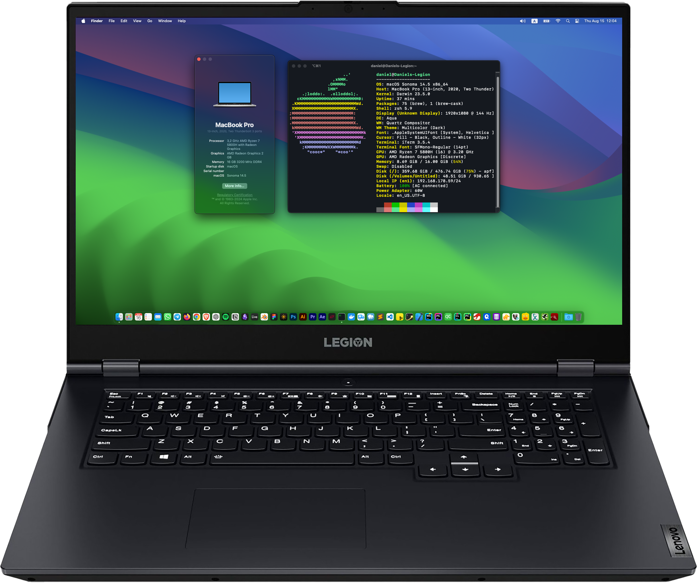
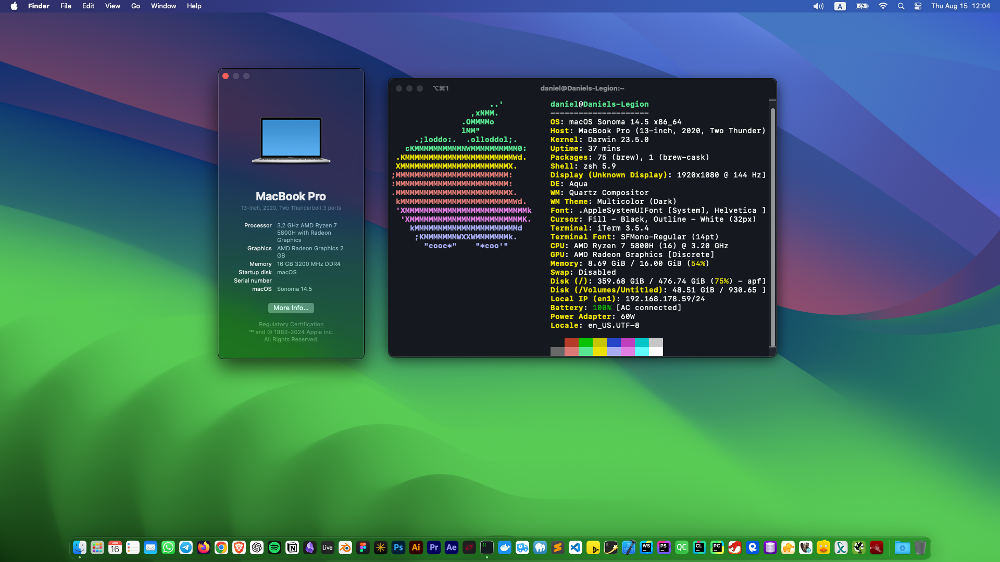
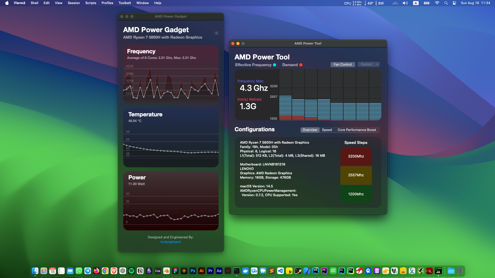
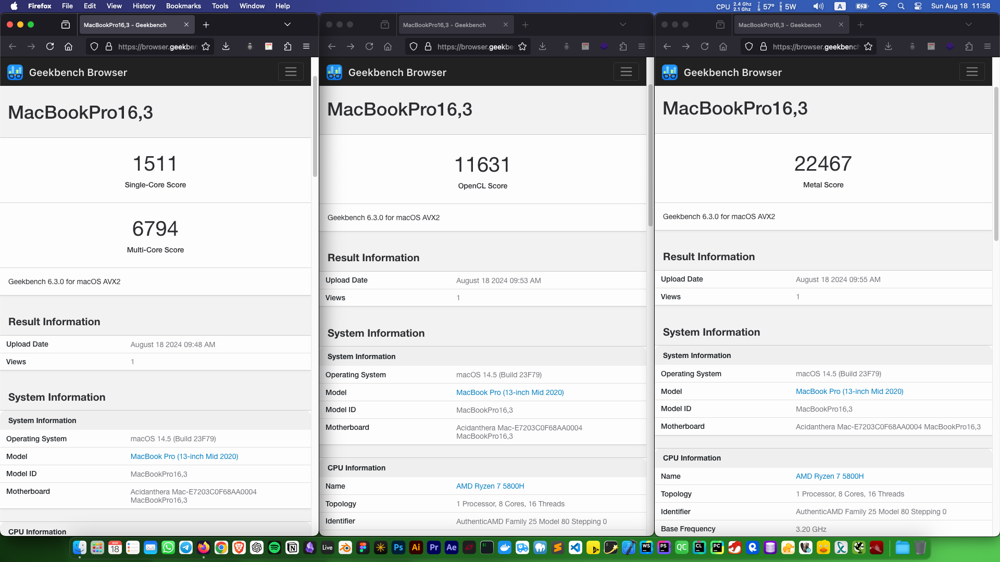

 <h2 align="center">macOS on Lenovo Legion 5 17ACH6H - AMD Ryzen 5800H &amp; NVIDIA RTX 3060</h2>

  

<h4 align="center">OpenCore config for Hackintosh on Lenovo Legion 5 17ACH6H</h4>

     
    

## Table of Contents

- [Specifications](#specifications)
- [What's Working](#whats-working)
- [What's not Working](#whats-not-working)
- [BIOS Settings](#bios-settings)
- [Kexts Used](#kexts-used)
- [SSDTs Used](#ssdts-used)
- [Boot Arguments Used](#boot-arguments-used)
- [Screenshots](#screenshots)
- [Installation Steps](#installation-steps)
- [Useful Software](#useful-software)
- [Credits](#credits)
- [Legal Disclaimer](#legal-disclaimer)

## Specifications

| Type | Spec | Status |
| ------------ | ------------ | ------------ |
| Model | Legion 5 17ACH6H Type 82JY | ✅
| BIOS | GKCN65WW | ✅
| CPU | AMD Ryzen 7 5800H 8 Cores / 16 Threads | ✅
| iGPU | AMD Radeon Graphics 2GB | ✅
| dGPU | NVIDIA GeForce RTX 3060 Laptop GPU 6GB | ❌
| RAM | 2x 8GB Samsung DDR4 3200 MHz (also tested with 2x16GB Crucial DDR4 3200 MHz) | ✅
| NVMe | Samsung SSD 512GB for macOS / Samsung SSD 980 1TB for Windows and Ubuntu Desktop | ✅
| Wi-Fi | Intel Wi-Fi 6E AX210 (laptop was originally equipped with a Realtek Wi-Fi adapter) | ✅
| Bluetooth | With Intel Wi-Fi 6E AX210 | ✅
| Ethernet | Realtek RTL8168/8111 | ✅
| Audio | Realtek ALC287 | ✅
| Display | 17,3 FHD IPS 144Hz | ✅
| Opencore | 1.0.1 | ✅
| SMBIOS | MacBookPro16,3 (serial number generated with [GenSMBIOS](https://github.com/corpnewt/GenSMBIOS "GenSMBIOS")) | ✅
| OS  | macOS Sonoma 14.5 | ✅

## What's Working

| Type | Notes | Status |
| --- | --- | --- |
| CPU | With [AMD Vanilla OpenCore](https://github.com/AMD-OSX/AMD_Vanilla) kernel patches | ✅
| iGPU | With [NootedRed.kext](https://github.com/ChefKissInc/NootedRed) | ✅
| Brightness Control | With [BrightnessKeys kext](https://github.com/acidanthera/BrightnessKeys) | ✅
| USB | With [GUX-RyzenXHCIFix.kext](https://github.com/RattletraPM/GUX-RyzenXHCIFix) and [USBMap.kext](https://github.com/corpnewt/USBMap)| ✅
| Keyboard | With [VoodooPS2Controller.kext](https://github.com/acidanthera/VoodooPS2) | ✅
| Touchpad | Thanks [MinecraftNerrd1337](https://github.com/MinecraftNerrd1337) for the touchpad fix (remove SSDT-HPET) | ✅
| Audio | With [AppleALC.kext](https://github.com/acidanthera/AppleALC) and boot argument "alcid=21" | ✅
| P2 Mic | Working with AppleALC 1.8.8 | ✅
| Camera | It just worked lol | ✅
| Ethernet | With [RealtekRTL8111.kext](https://github.com/Mieze/RTL8111_driver_for_OS_X) | ✅
| Intel Wi-Fi | With [itlwm](https://github.com/OpenIntelWireless/itlwm) kexts | ✅
| Bluetooth | With [IntelBluetoothFirmware](https://github.com/OpenIntelWireless/IntelBluetoothFirmware) kexts | ✅
| Battery Status | With [SMCBatteryManager.kext](https://github.com/acidanthera/VirtualSMC) | ✅
| AppleTV + DRM | Works with CFG_LINK_FIXED_MAP=1 | ✅
| iServices | AppStore, Messages, FaceTime, iCloud | ✅
| Shutdown / Reboot | | ✅

## What's not Working

| Type | Notes | Status |
| --- | --- | --- |
| dGPU | Apple dropped support for NVIDIA GPUs (you will have to turn hardware acceleration off) | ❌
| HDMI | Connected to dGPU | ❌
| Sleep / Wake |  | ❌

## BIOS Settings

*   **Dynamic/Switchable** GPU
*   Device Guard **Disabled**
*   Secure Boot **Disabled**

## Kexts Used

| Kext | Description |
| --- | --- |
| [AirportItlwm.kext](https://github.com/OpenIntelWireless/itlwm) | Patches Intel Wi-Fi |
| [AMDRyzenCPUPowerManagement.kext](https://github.com/trulyspinach/SMCAMDProcessor) | Enables power management and monitoring for AMD CPUs |
| [AppleALC.kext](https://github.com/acidanthera/AppleALC) | Enables native macOS HD audio for not officially supported codecs |
| [AppleMCEReporterDisabler.kext](https://github.com/acidanthera/bugtracker/files/3703498/AppleMCEReporterDisabler.kext.zip) | Disables AppleIntelMCEReporter which causes panics on AMD CPUs |
| [BlueToolFixup.kext](https://github.com/acidanthera/BrcmPatchRAM) | Patches Bluetooth |
| [BrightnessKeys.kext](https://github.com/acidanthera/BrightnessKeys) | Enables brightness keys |
| [ForgedInvariant.kext](https://github.com/ChefKissInc/ForgedInvariant) | Enables TSC synchronization |
| [GUX-RyzenXHCIFix](https://github.com/RattletraPM/GUX-RyzenXHCIFix) | Fixes USB3 |
| [IntelBluetoothFirmware.kext](https://github.com/OpenIntelWireless/IntelBluetoothFirmware) | Patches Bluetooth |
| [IntelBTPatcher.kext](https://github.com/OpenIntelWireless/IntelBluetoothFirmware) | Patches Bluetooth |
| [itlwm.kext](https://github.com/OpenIntelWireless/itlwm) | Patches Intel Wi-Fi |
| [Lilu.kext](https://github.com/acidanthera/Lilu) | Kernel extension bringing a platform for arbitrary kext, library, and program patching throughout macOS |
| [NootedRed.kext](https://github.com/ChefKissInc/NootedRed) | Patches AMD iGPU |
| [NoTouchID.kext](https://github.com/al3xtjames/NoTouchID) | Disables Touch ID support |
| [NVMeFix.kext](https://github.com/acidanthera/NVMeFix) | Improves compatibility with non-Apple SSDs |
| [RealtekRTL8111.kext](https://github.com/Mieze/RTL8111_driver_for_OS_X) | Patches Ethernet |
| [RestrictEvents.kext](https://github.com/acidanthera/RestrictEvents) | Blocks unwanted processes causing compatibility issues and unlocks the support for certain restricted features |
| [SMCAMDProcessor.kext](https://github.com/trulyspinach/SMCAMDProcessor) | Enables power management and monitoring for AMD processors |
| [SMCBatteryManager.kext](https://github.com/acidanthera/VirtualSMC) | Enables battery status |
| [USBMap.kext](https://github.com/corpnewt/USBMap "USBMap") | Script for mapping USB ports in macOS and creating a custom injector kext |
| [USBWakeFixup](https://github.com/osy/USBWakeFixup) | Fixes USB wake up issue on macOS |
| [VirtualSMC.kext](https://github.com/acidanthera/VirtualSMC) | Advanced Apple SMC emulator in the kernel |
| [VoodooI2C.kext](https://chefkissinc.github.io/Extras/Kexts/VoodooI2C.zip) | Enables keyboard |
| [VoodooPS2Controller.kext](https://github.com/acidanthera/VoodooPS2) | Enables keyboard |

## SSDTs Used

Created with [SSDTTime](https://github.com/corpnewt/SSDTTime) on Windows 11

| Table | Description |
| --- | --- |
| SSDT-EC | Adds a fake Embedded Controller device |
| SSDT-PLUG-ALT | Fixes CPU definitions |
| SSDT-PNLF | Sets up a PNLF device for laptop backlight control |
| SSDT-USBX | Enables USB Power Management |
| SSDT-XOSI | Spoof macOS to Windows for some ACPI features |

## Boot Arguments Used

boot-arg | Info
---------|---------
-v | Enables verbose
-wegnoegpu | Disables dGPU
alcid=21 | Layout ID for AppleALC kext

## Screenshots

 
 

## Installation Steps

### 1. Download OpenCore Config
Start by downloading the OpenCore configuration file provided in this repository.

### 2. Obtain the Necessary Kexts
Download all the required kexts from the "Used Kexts" list provided earlier. Once downloaded, copy them to the following directory:
EFI -> OC -> Kexts

### 3. Download macOS Sonoma Recovery Environment
Use the [macrecovery.py](https://github.com/acidanthera/OpenCorePkg/tree/master/Utilities/macrecovery) to download the macOS Sonoma 14.5 recovery environment.

### 4. Generate Serial Number and UUID
Use [GenSMBIOS](https://github.com/corpnewt/GenSMBIOS) to generate a valid serial number and UUID.

### 5. Edit the OpenCore Config
Open the config.plist file using [ProperTree](https://github.com/corpnewt/ProperTree). Navigate to Root -> PlatformInfo -> Generic. Enter the serial number and UUID you generated in the previous step.

### 6. Prepare the USB Drive
Format a USB drive to FAT32, then copy the following to the drive:

* The OpenCore configuration (both EFI and NVRAM folders)
* The macOS Sonoma 14.5 recovery environment (com.apple.recovery.boot folder)

### 7. Replace NootedRed.kext with WhateverGreen.kext
Replace NootedRed.kext file with [WhateverGreen.kext](https://github.com/acidanthera/WhateverGreen/releases). This is crucial for successfully booting into the recovery environment. Make new OC snapshot in [ProperTree](https://github.com/corpnewt/ProperTree) to reflect the change.

### 8. Boot from USB and Format SSD
Boot your machine from the USB drive. Once in the macOS recovery environment, format your target SSD to the APFS format using Disk Utility.

### 9. Install macOS
Begin the macOS installation on your freshly formatted SSD. If your system doesn’t have Wi-Fi support at this point, connect an Ethernet cable to ensure the recovery environment can download macOS files.

### 10. System Reboots During Installation
During the installation process, your machine will reboot multiple times. No user intervention is needed until the installation completes.

### 11. Create a User Account
After the macOS installation finishes, follow the setup process to create your user account.

### 12 Enable iGPU Support
To activate the integrated GPU (iGPU), replace WhateverGreen.kext with NootedRed.kext in your EFI folder. Again, make new OC snapshot in [ProperTree](https://github.com/corpnewt/ProperTree) to reflect the change.

### 13. Reboot from USB
Reboot the system from the USB drive. At this point, your iGPU should now be working.

### 14. Boot Without the USB Drive
To enable booting from the SSD without needing the USB drive, use MountEFI to mount the EFI partition of your SSD. Copy all files from the USB to the SSD’s EFI partition.

## Useful Software
| Software | Description |
| --- | --- |
| [macrecovery.py](https://github.com/acidanthera/OpenCorePkg/tree/master/Utilities/macrecovery) | Tool that helps to automate recovery interaction. It can be used to download diagnostics and recovery as well as analyse MLB |
| [GenSMBIOS](https://github.com/corpnewt/GenSMBIOS) | Script to generate SMBIOS |
| [SSDTTime](https://github.com/corpnewt/SSDTTime) | Tool designed to make creating SSDTs simple |
| [ProperTree](https://github.com/corpnewt/ProperTree) | Cross platform GUI plist editor |
| [USBMap](https://github.com/corpnewt/USBMap) | Script for mapping USB ports in macOS and creating a custom injector kext |
| [MountEFI](https://github.com/corpnewt/MountEFI) | Script for mounting any EFI partition on macOS |
| [Hackintool](https://github.com/benbaker76/Hackintool) | The Swiss army knife of vanilla Hackintoshing  |
| [OpenCore Legacy Patcher](https://github.com/dortania/OpenCore-Legacy-Patcher) | Tool for creating bootable macOS drive and post-installing root patches |
| [AMD Power Gadget](https://github.com/trulyspinach/SMCAMDProcessor) | Tool for monitoring CPU frequency and temperature. Automaticly adjusts CPU speed |
| [WinDiskWriter](https://github.com/TechUnRestricted/WinDiskWriter) | Windows bootable drive creator for macOS |

## Credits

*   [kalkmann](https://github.com/kalkmann) for [Legion-5600H-Hackintosh](https://github.com/kalkmann/Legion-5600H-Hackintosh) guide
*   [yusufklncc](https://github.com/yusufklncc) for [Lenovo-Legion-5-Hackintosh](https://github.com/yusufklncc/Lenovo-Legion-5-Hackintosh) guide
*   [ChefKissInc](https://chefkissinc.github.io/) for [AMD Hackintosh Guide](https://chefkissinc.github.io/guides/hackintosh/), [ForgedInvariant.kext](https://github.com/ChefKissInc/ForgedInvariant), [NootedRed.kext](https://github.com/ChefKissInc/NootedRed)
*   [Dortania](https://github.com/dortania) for [OpenCore Install Guide](https://dortania.github.io/OpenCore-Install-Guide/) and [OpenCore Legacy Patcher](https://github.com/dortania/OpenCore-Legacy-Patcher)
*   [Acidanthera](https://github.com/acidanthera) for [OpenCore bootloader](https://github.com/acidanthera/OpenCorePkg), [macrecovery.py](https://github.com/acidanthera/OpenCorePkg/tree/master/Utilities/macrecovery), [AppleALC.kext](https://github.com/acidanthera/AppleALC), [Lilu.kext](https://github.com/acidanthera/AppleALC), [AppleMCEReporterDisabler.kext](https://github.com/acidanthera/bugtracker/files/3703498/AppleMCEReporterDisabler.kext.zip), [BlueToolFixup.kext](https://github.com/acidanthera/BrcmPatchRAM), [BrightnessKeys.kext](https://github.com/acidanthera/BrightnessKeys), [NVMeFix](https://github.com/acidanthera/NVMeFix), [RestrictEvents.kext](https://github.com/acidanthera/RestrictEvents), [VirtualSMC.kext](https://github.com/acidanthera/VirtualSMC), [SMCBatteryManager](https://github.com/acidanthera/VirtualSMC) and [VoodooPS2Controller.kext](https://github.com/acidanthera/VoodooPS2)
*   [CorpNewt](https://github.com/acidanthera) for [GenSMBIOS](https://github.com/corpnewt/GenSMBIOS), [SSDTTime](https://github.com/corpnewt/SSDTTime), [ProperTree](https://github.com/corpnewt/ProperTree), [USBMap](https://github.com/corpnewt/USBMap), and [MountEFI](https://github.com/corpnewt/MountEFI)
*   [AMD OS X](https://github.com/acidanthera) for [AMD Vanilla OpenCore](https://github.com/AMD-OSX/AMD_Vanilla) kernel patches
*   [benbaker76](https://github.com/benbaker76) for [Hackintool](https://github.com/benbaker76/Hackintool)
*   [trulyspinach](https://github.com/trulyspinach) for [SMCAMDProcessor.kext](https://github.com/trulyspinach/SMCAMDProcessor), [AMDRyzenCPUPowerManagement.kext](https://github.com/trulyspinach/SMCAMDProcessor) and [AMD Power Gadget](https://github.com/trulyspinach/SMCAMDProcessor)
*   [TechUnRestricted](https://github.com/TechUnRestricted) for [WinDiskWriter](https://github.com/TechUnRestricted/WinDiskWriter)
*   [OpenIntelWireless](https://github.com/OpenIntelWireless) for [AirportItlwm.kext](https://github.com/OpenIntelWireless/itlwm), [itlwm.kext](https://github.com/OpenIntelWireless/itlwm), [IntelBluetoothFirmware.kext](https://github.com/OpenIntelWireless/IntelBluetoothFirmware) and [IntelBTPatcher.kext](https://github.com/OpenIntelWireless/IntelBluetoothFirmware)
*   [RattletraPM ](https://github.com/RattletraPM) for [GUX-RyzenXHCIFix](https://github.com/RattletraPM/GUX-RyzenXHCIFix)
*   [Alex James](https://github.com/al3xtjames) for [NoTouchID.kext](https://github.com/al3xtjames/NoTouchID)
*   [Laura Müller](https://github.com/Mieze) for [RealtekRTL8111.kext](https://github.com/Mieze/RTL8111_driver_for_OS_X)
*   [osy](https://github.com/osy) for [USBWakeFixup.kext](https://github.com/osy/USBWakeFixup)
*   [VoodooI2C](https://github.com/VoodooI2C) for [VoodooI2C.kext](https://github.com/VoodooI2C/VoodooI2C) 

## Legal Disclaimer

This guide is provided solely for **educational and testing purposes**. The author does not condone or encourage any illegal activities, including but not limited to the violation of software license agreements, terms of service, or copyright laws. Building or using a Hackintosh — a non-Apple computer running macOS — may violate **Apple's End User License Agreement (EULA)** and could be illegal in certain jurisdictions.

By following this guide, you understand that **you assume full responsibility** for any legal consequences, technical issues, or damages that may arise, including but not limited to violations of Apple's terms of service, potential breaches of applicable laws, and the invalidation of warranties. The author is not liable for any losses, damages, legal actions, or technical malfunctions resulting from the use of this guide.

The author explicitly **does not endorse or encourage** the illegal use of macOS or other software in any way that infringes upon intellectual property rights, terms of service, or other legal agreements. The guide is intended to be used for testing in environments where such use is permitted.

Before proceeding, users are strongly advised to **consult with a legal professional** to understand the legality of building or using a Hackintosh in their specific region or jurisdiction. All actions undertaken by the reader are done at their **own risk and discretion**.

By using this guide, you agree that any risks involved are **your own responsibility**, and you indemnify the author from any legal or financial consequences that may arise from your actions.
